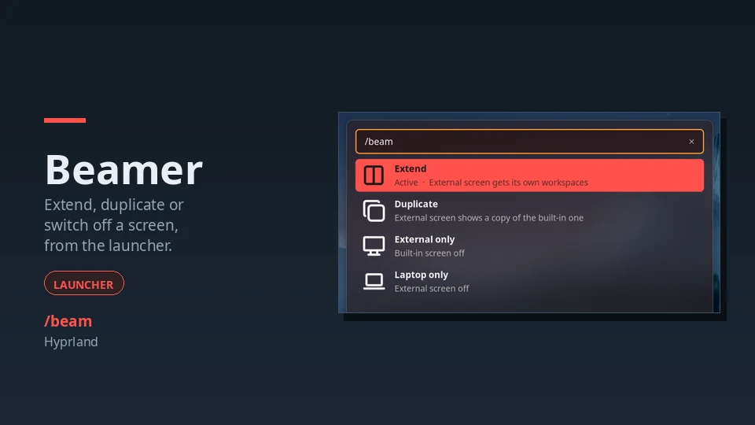
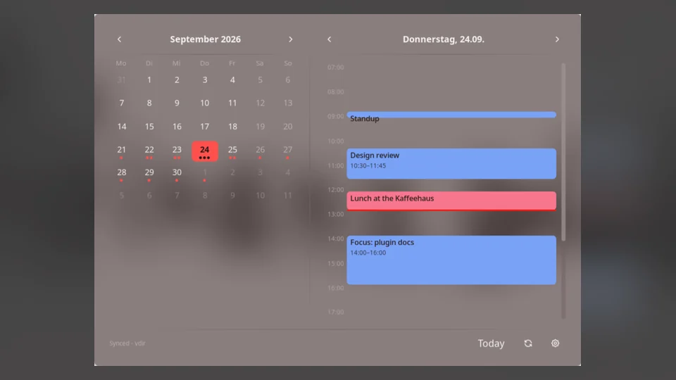
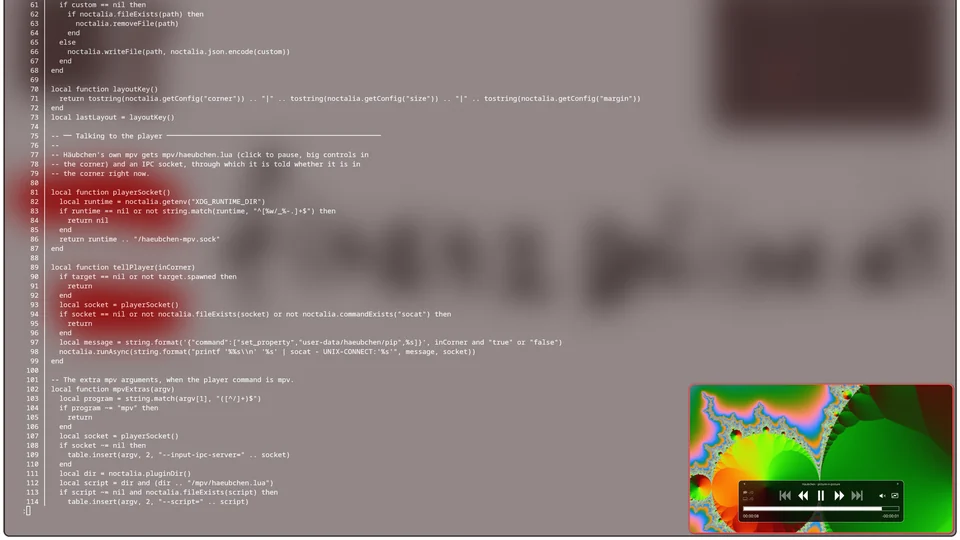
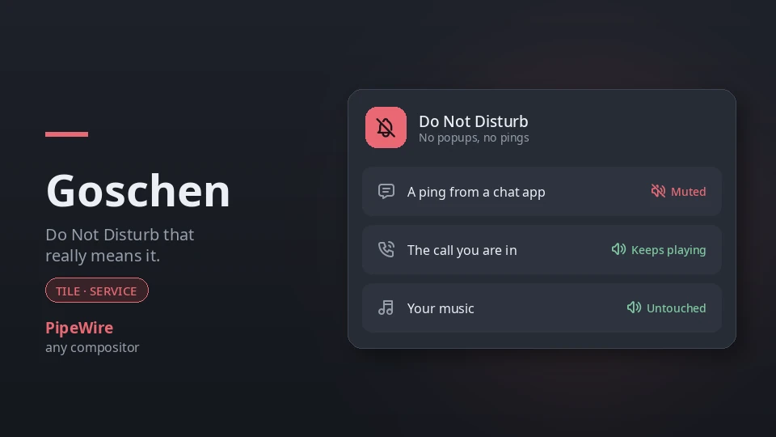
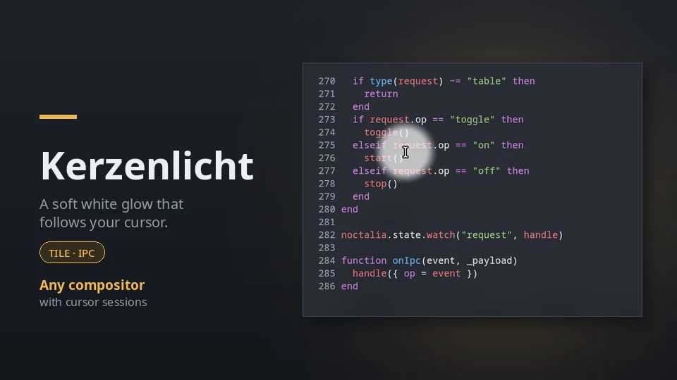

# Kaffeehaus — Noctalia plugins for Hyprland and Wayland

A [Noctalia](https://noctalia.dev) **plugin source** — one room, a long menu.
Add it once and every plugin in here shows up in the Noctalia plugin store like
any other, updates included: a Win+P **display switcher** for Hyprland, a
**calendar** with month and day widgets, **picture-in-picture** for any
window or stream, a **Do Not Disturb** that actually keeps Discord quiet, and a
**spotlight** that puts a soft white glow around your cursor.

| [Beamer](beamer/README.md) | [Fiaker](fiaker/README.md) | [Häubchen](haeubchen/README.md) |
| --- | --- | --- |
| [](beamer/README.md) | [](fiaker/README.md) | [](haeubchen/README.md) |
| [**Goschen**](goschen/README.md) | [**Kerzenlicht**](kerzenlicht/README.md) | |
| [](goschen/README.md) | [](kerzenlicht/README.md) | |

| Plugin | | What it does |
| --- | --- | --- |
| **[Beamer](beamer/README.md)** | `1.0.0` | Switch Hyprland between extend, duplicate, external only and laptop only — from the launcher, a control-center tile, or one IPC call you can bind to your display key. |
| **[Fiaker](fiaker/README.md)** | `0.1.1` | A calendar that keeps the month grid and the day timeline as separate, synchronized widgets, with a live now-line. |
| **[Häubchen](haeubchen/README.md)** | `0.1.0` | Picture-in-picture for any window or stream: pick it with `/pip` or one key, or let it spot streams itself, and it follows you into a corner whenever you leave its workspace. Hyprland, sway and niri. |
| **[Goschen](goschen/README.md)** | `0.1.0` | Do Not Disturb that really means it: while it is on, the pings Discord, Telegram and friends play themselves are muted too, and the call you are in and your music keep playing. PipeWire. |
| **[Kerzenlicht](kerzenlicht/README.md)** | `0.1.0` | A spotlight for your cursor: a soft white glow follows it across every monitor, click-through, for screen shares, recordings and talks. Any compositor with cursor sessions. |

## Install

Add the source once:

```sh
noctalia msg plugins source add kaffeehaus git https://github.com/137-Trimethylxanthin/noctalia-kaffeehaus
```

Then enable whichever plugins you want:

```sh
noctalia msg plugins enable 137-trimethylxanthin/beamer
noctalia msg plugins enable 137-trimethylxanthin/fiaker
noctalia msg plugins enable 137-trimethylxanthin/haeubchen
noctalia msg plugins enable 137-trimethylxanthin/goschen
noctalia msg plugins enable 137-trimethylxanthin/kerzenlicht
```

`source add` clones the repo into Noctalia's plugin cache; `enable` exports a
plugin and starts it. Both are also available in **Settings → Plugins**, where
`https://github.com/137-Trimethylxanthin/noctalia-kaffeehaus` goes in under
*Sources → Add*.

To pick up new versions later:

```sh
noctalia msg plugins update kaffeehaus
```

One source carries every plugin, so a single `update` covers everything in
here.

## Before you rely on them

**Beamer** requires Hyprland with `hyprctl` on `PATH`.

**Fiaker** ships empty until it has a source of events. Noctalia's plugin API
does not expose the built-in calendar, so the working backend is a directory of
`.ics` files — the layout `vdirsyncer` produces. Set **vdir path** in
**Settings → Plugins → Fiaker** to that directory.

**Häubchen** runs on Hyprland (`hyprctl` and `socat`), sway (`swaymsg`) or niri
(`niri` and `socat`); only Hyprland has been tested on a real session so far.
Opening a stream in its own player also needs one — mpv with `yt-dlp` by
default. Following a window you already have open does not.

**Goschen** needs PipeWire with WirePlumber, plus `pactl` and `pacat`
(`libpulse` / `pulseaudio-utils`). It mutes per app, not per sound, so an app
in a call keeps its pings along with the call.

**Kerzenlicht** needs `uv` (it fetches pywayland on first use), `pkill` and
`pgrep`, and a compositor with `ext-image-copy-capture-v1` cursor sessions. It is tested on
Hyprland; wlroots 0.19+ compositors and niri newer than v26.04 should work.

Each plugin's own README has the full documentation — every widget, setting and
caveat.

## Repository layout

```
beamer/           a plugin; this is what Noctalia exports
fiaker/, …        the others
  plugin.toml     manifest: id, entries, metadata
  *.luau          entry scripts
  lib/            shared modules
  translations/   label_key / description_key strings
  README.md       the plugin's page in the store
  thumbnail.webp  its card image
  screenshots/    README images, where a plugin has more than the card
tests/            pure-logic tests, per plugin; not shipped to Noctalia
catalog.toml      source index; regenerated by CI on every push
```

Every plugin is one top-level directory holding a `plugin.toml`. Adding another
one is exactly that — a new directory; CI picks it up with no configuration.

`catalog.toml` is what makes the git route work: Noctalia reads it to render and
compat-check the source before cloning anything else. It is generated from every
`*/plugin.toml` by `.github/workflows/update-catalog.py` and committed, so
bumping `version` in a manifest is all a release takes. To regenerate it by hand:

```sh
uv run .github/workflows/update-catalog.py
```

## Developing

Point Noctalia at your checkout instead of at GitHub — a `path` source is scanned
directly, with no catalog involved, and `.luau` edits hot-reload:

```sh
noctalia msg plugins source add dev path ~/Documents/code/noctalia-kaffeehaus
noctalia plugins lint beamer
noctalia plugins lint fiaker
noctalia plugins lint haeubchen
noctalia plugins lint goschen
noctalia plugins lint kerzenlicht
./tests/fiaker/run.sh
./tests/haeubchen/run.sh
./tests/goschen/run.sh
./tests/kerzenlicht/run.sh
```

## License

MIT — see [LICENSE](LICENSE).
