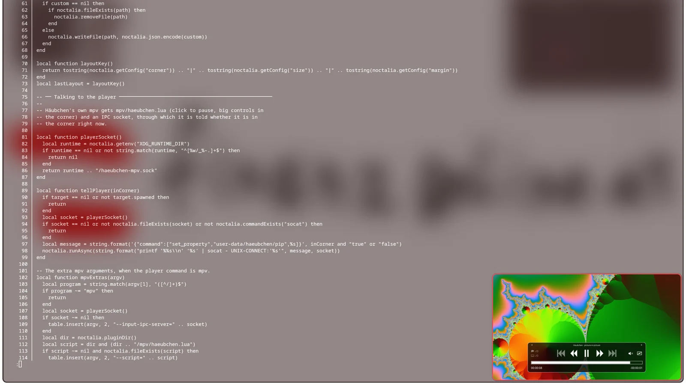
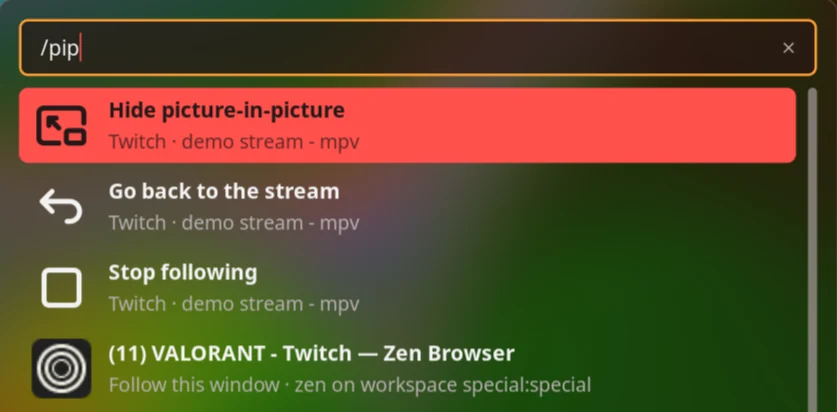
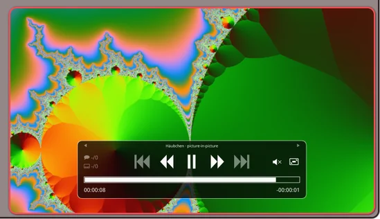

# Häubchen — picture-in-picture for Hyprland, sway, Scroll, niri and MangoWC

**A [Noctalia](https://noctalia.dev) shell plugin that gives any Wayland window a
floating, always-on-top picture-in-picture mode** — a Twitch or YouTube stream,
an mpv video, a video call — with a `/pip` launcher command, a keybind, and
YouTube-style player controls.



In a Viennese coffee house, the *Häubchen* — "little hood" — is the cap of
cream that sits on top of the coffee. This one sits on top of your screen: pick
a window, and whenever you switch away from its workspace it follows you into a
corner — floating, pinned, small, always on top. Go back to its workspace and
it slots back in exactly where it was.

It works with any window, stream or not: a browser on Twitch, mpv, a video
call, a build log. Pick it from `/pip`, press one key on the focused window, or
let Häubchen spot streams by itself. It can also open a stream in a dedicated
player for you.

| `/pip` in the Noctalia launcher | The corner player, with controls on hover |
| --- | --- |
|  |  |

## Plugin

| Field | Value |
| --- | --- |
| ID | `137-trimethylxanthin/haeubchen` |
| Entries | Service: `watch`; launcher provider: `pip`; shortcut: `toggle` |
| Launcher Prefix | `/pip` |

## Requirements

One of these compositors, detected at startup:

| Compositor | Needs | Status |
| --- | --- | --- |
| **Hyprland** | `hyprctl`, `socat` | Built and tested on 0.56 with the Lua config parser |
| **sway** | `swaymsg` | Written against sway's IPC, not yet tested on a real session |
| **Scroll** | `scrollmsg` | sway's IPC, so the sway backend with Scroll's own program; not yet tested |
| **niri** | `niri`, `socat` | Written against niri-ipc, not yet tested on a real session |
| **MangoWC** | `mmsg` | Written against Mango 0.17.3's IPC, not yet tested on a real session |
| labwc | | Not supported: no IPC that can float, move or resize a window |
| dwl | | Not supported: no IPC at all; its IPC patches only cover tags and layout |
| Triad | | Not supported: it moves only the focused floating window, by relative steps |
| Umbriel | | Not supported: no absolute move or resize, and pin acts on the focused window only |

Missing tools, or a compositor Häubchen cannot drive, are reported once in a
notification, and `/pip` says so at the top. `/pip twitch …` and friends still
open the stream in the player there; it just stays a normal window.

For `/pip twitch …` and friends, a player: mpv by default, which needs `yt-dlp`
to open Twitch and YouTube (`uv tool install yt-dlp`). Following a window you
already have open needs neither.

**Hyprland.** Both config parsers are supported. On the Lua parser
(`hyprland.lua`) windows are moved with `hyprctl eval` and `hl.dsp.window.*`. On
hyprlang (`hyprland.conf`) Häubchen falls back to the classic dispatchers through
`hyprctl --batch`. The parser is detected once per session. The hyprlang path
has not been tested on a real session yet, and there a fullscreen window is not
taken out of fullscreen before it goes into the corner, because hyprlang's
`fullscreenstate` only acts on the focused window.

**sway.** The corner window is made floating and `sticky`, which keeps it on
screen across workspace switches on its output. The bar is respected: the
corner is placed inside the focused workspace's area.

**Scroll.** Floating, `sticky` and absolute placement are sway's; Scroll's own
`pin` (a column pinned to a screen edge) is not used. Leaving the corner puts
the window back into the scrolling row at the focused position, which may not
be its old column.

**MangoWC.** The corner window is made floating and *global*, Mango's way of
showing a window on every tag of its monitor. Workspaces are tags, one set per
monitor. Mango reports the whole monitor, bar included, so if the corner
overlaps your bar, raise the margin.

**niri.** niri has no way to pin a window to every workspace, so Häubchen moves
it along: each time you switch workspace, the corner window is moved to the new
one and placed again, a beat behind the switch. niri's IPC does not say how tall
the bar is, so the corner is computed on the whole output; if it overlaps a bar,
raise the margin. niri does not report fullscreen state either, so a fullscreen
window comes back from the corner as a normal tile.

## Usage

There are three ways to pick the window Häubchen watches.

**The keybind** (below) toggles picture-in-picture for the focused window:
press it on any window to have Häubchen follow it, press it again on the same
window to let go.

**Auto-follow** (off by default, one switch in the settings) picks up streams
by itself: a window whose title shows Twitch, YouTube or Kick, or the player
Häubchen opened. It only grabs a window when nothing else is being followed. If
the tab moves off the stream, it lets go, and a window you stopped following by
hand is never grabbed again until it is reopened. A window you pick yourself
always wins over one it found.

Mind your scratchpad: a stream you park in a special workspace is off screen by
definition, so with auto-follow on it goes straight into the corner.

**The launcher.** Type `/pip`.

- **Every open window** is listed, streams first: titles mentioning Twitch,
  YouTube or Kick lead, then player apps such as mpv. Pick one and Häubchen
  follows it. Typing filters the list.
- **`/pip twitch <channel>`**, **`/pip kick <channel>`**, **`/pip yt <video id>`**
  or any `https://` URL opens it in the player, and Häubchen follows the player
  window as soon as it maps.
- While a window is being followed, the top rows are **Hide / Show
  picture-in-picture**, **Go back to the stream** and **Stop following**.

### What happens then

What counts as *switching away* is the window's workspace leaving the screen,
not focus leaving the window. Clicking a terminal tiled next to the stream does
nothing; switching to another workspace sends the stream to the corner. With
several monitors, the stream only moves if its workspace is not visible on any
of them, and it goes into the corner of the monitor you are on at that moment.
On Hyprland, sway, Scroll and MangoWC it then stays on that monitor; on niri
it follows your workspace switches.

Leaving the corner restores the window the way it was: tiled back into its
workspace, back to its floating position and size, or back to fullscreen.
Unpinning the small window by hand tells Häubchen you have taken over; it leaves
the window where it is and keeps following it from there.

### Moving and resizing it

The corner window is an ordinary floating window, so it moves and resizes the
way every window does on your compositor — on Hyprland with the usual
`SUPER` + drag and `SUPER` + right-drag. On Hyprland it keeps 16:9 while you
resize.

Häubchen remembers where you put it: the next time a window goes into the
corner, it goes there, at that size. The spot is stored relative to the
screen, so it lands in the same place on a monitor of another size, and it
survives restarts. **Reset size and position** in `/pip` (or the `reset` IPC
event) goes back to the corner from the settings; so does changing the corner,
size or margin setting.

### Player controls

When Häubchen opens a stream in mpv itself, the player behaves like a
browser's picture-in-picture:

| | |
| --- | --- |
| Click | Pause / play |
| Drag | Move the window |
| Scroll | Volume |
| Double-click | In the corner: back to the stream's workspace. At home: fullscreen |
| Hover | In the corner, one panel with large play/pause, skip, seek and volume buttons appears over the picture; at home, mpv's usual bar |

That comes from a small mpv script shipped with the plugin
(`mpv/haeubchen.lua`), which Häubchen adds to the player command along with an
IPC socket at `$XDG_RUNTIME_DIR/haeubchen-mpv.sock`, through which it tells the
player when it enters and leaves the corner. It is only added when the player
command is mpv.

A window you follow that Häubchen did not open keeps its own controls: a
browser's Twitch or YouTube player already pauses on click and shows its
controls on hover.

### Hiding it for a moment

**Hide** sends the stream home and keeps it out of the corner until you press
it again, or until you leave its workspace and come back to it, which resumes
the normal behavior. Pressed while you are looking at the stream, it keeps it
from going into the corner when you switch away.
Bind it to a key (below) to get the corner player out of the way for a
screenshot or a call.

The `toggle` shortcut is a control-center tile that does the same on click, and
jumps back to the stream on right-click. Add it under **Settings → Control
Center shortcuts**.

## Keybinds

The `watch` service takes these events over IPC:

```sh
noctalia msg plugin 137-trimethylxanthin/haeubchen:watch all window          # PiP on/off for the focused window
noctalia msg plugin 137-trimethylxanthin/haeubchen:watch all toggle          # hide / show
noctalia msg plugin 137-trimethylxanthin/haeubchen:watch all follow active   # follow the focused window (never lets go)
noctalia msg plugin 137-trimethylxanthin/haeubchen:watch all follow 0x55…    # follow by address
noctalia msg plugin 137-trimethylxanthin/haeubchen:watch all back            # go to the stream's workspace
noctalia msg plugin 137-trimethylxanthin/haeubchen:watch all reset           # forget the dragged size and position
noctalia msg plugin 137-trimethylxanthin/haeubchen:watch all stop
noctalia msg plugin 137-trimethylxanthin/haeubchen:watch all play "twitch shroud"
```

In `hyprland.lua`:

```lua
local haeubchen = "noctalia msg plugin 137-trimethylxanthin/haeubchen:watch all "
hl.bind("SUPER + SHIFT + O", hl.dsp.exec_cmd(haeubchen .. "window"))  -- this window in/out of PiP
hl.bind("SUPER + O",         hl.dsp.exec_cmd(haeubchen .. "toggle"))  -- hide / show
```

In `hyprland.conf`:

```
bind = SUPER SHIFT, O, exec, noctalia msg plugin 137-trimethylxanthin/haeubchen:watch all window
bind = SUPER, O, exec, noctalia msg plugin 137-trimethylxanthin/haeubchen:watch all toggle
```

In sway's config:

```
bindsym $mod+Shift+o exec noctalia msg plugin 137-trimethylxanthin/haeubchen:watch all window
bindsym $mod+o exec noctalia msg plugin 137-trimethylxanthin/haeubchen:watch all toggle
```

In niri's `config.kdl`:

```kdl
binds {
    Mod+Shift+O { spawn "noctalia" "msg" "plugin" "137-trimethylxanthin/haeubchen:watch" "all" "window"; }
    Mod+O { spawn "noctalia" "msg" "plugin" "137-trimethylxanthin/haeubchen:watch" "all" "toggle"; }
}
```

## Settings

| Setting | Default | |
| --- | --- | --- |
| Auto-follow streams | Off | Follow a stream window by itself, see [Usage](#usage) |
| Corner | Bottom right | Which corner of the focused monitor |
| Size | `0.25` | Width as a share of the monitor width; height follows at 16:9 |
| Margin | `16` | Gap to the screen edge and the bar, in logical pixels |
| Player command | `mpv --force-window=immediate --wayland-app-id=haeubchen {url}` | What `/pip twitch …` runs. `{url}` becomes one argument, never passed through a shell. For mpv, Häubchen adds its control script and IPC socket |
| Player window class | `haeubchen` | *Advanced.* The class the player's window opens with, so Häubchen can recognize it. Keep it in sync with the command |

A different player works as long as it opens its window with a known class.
For streamlink:

```
streamlink --player mpv --player-args=--wayland-app-id=haeubchen {url} best
```

Changing the corner, size or margin while the stream is in the corner moves it
right away.

## Notes

**One window at a time.** Following a new window lets go of the old one first,
putting it back home if it was in the corner.

**Closing.** *Stop following* on a window that Häubchen opened with the player
closes the player. On any other window it only lets go.

**Tests.** `./tests/haeubchen/run.sh` covers the decisions, each backend's
parsing of compositor output, and the commands the Mango backend builds;
moving windows is only covered by hand, on Hyprland.

**It recovers.** If the compositor's event stream ends (the compositor
restarted, the socket went away), Häubchen follows it again a few seconds
later, and a check every five seconds covers the gap. A step the compositor
never answers is given up after fifteen seconds, so the queue never wedges.

**Nothing is left pinned.** When Noctalia quits, the plugin is disabled, or the
service reloads, a window in the corner is put back first. A crash or `SIGKILL`
skips that; run *Stop following* or unpin it by hand.
