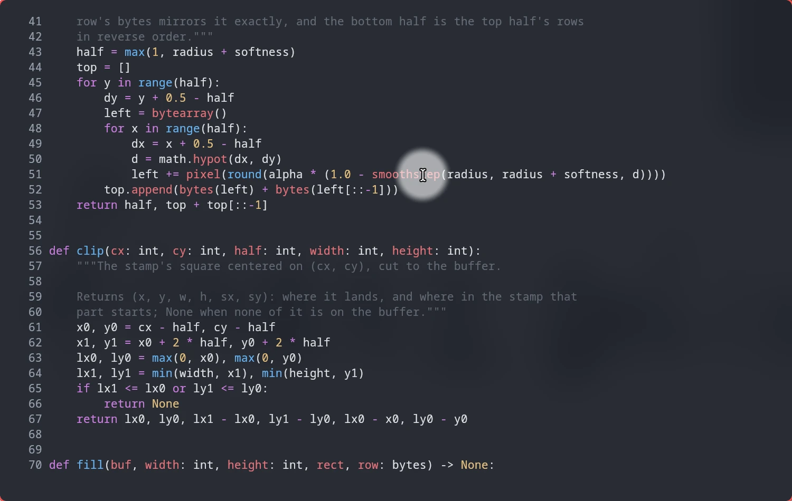
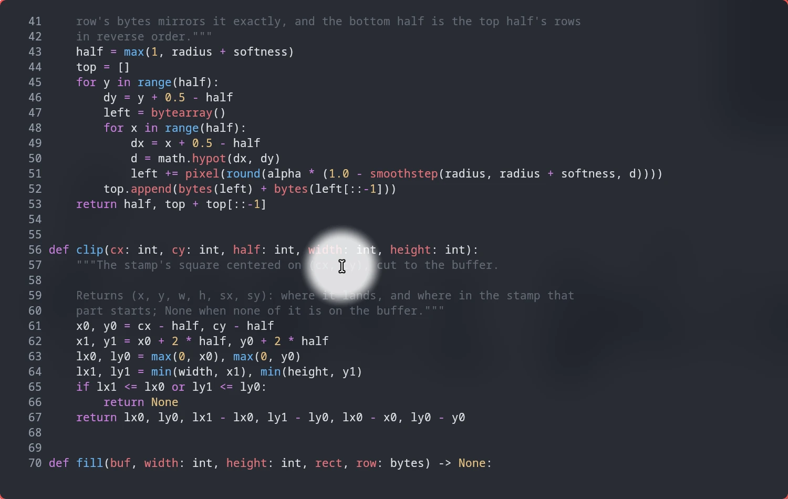

# Kerzenlicht — a spotlight for your cursor

**A [Noctalia](https://noctalia.dev) shell plugin that puts a soft white glow
around your mouse cursor**, on every monitor, on any compositor that can say
where the cursor is. One key turns it on; everything underneath keeps working.



*Kerzenlicht* is German for candlelight: the small, warm glow of the candle on
a coffee-house table, lighting that one spot and nothing more. This one
follows your mouse.

- **Show people where you are pointing.** In a screen share, a recording or a
  talk, a glow is easier to follow than a 24-pixel arrow, and it shows up in
  every capture because it is a real surface.
- **Find your cursor.** On a big monitor, or three of them, it is where the
  light is.
- **Never in the way.** The glow is click-through: clicks, typing, scrolling
  and dragging go straight to the window below. The rest of the screen is
  untouched.
- **Everywhere Noctalia runs,** not only on Hyprland: no screen shader, no
  compositor plugin, no config to edit.

## Plugin

| Field | Value |
| --- | --- |
| ID | `137-trimethylxanthin/kerzenlicht` |
| Entries | Service: `watch`; shortcut: `toggle` |

## Requirements

- [`uv`](https://docs.astral.sh/uv/). The light is a small Python Wayland
  client, and uv fetches its one dependency,
  [pywayland](https://pypi.org/project/pywayland/), the first time you switch
  it on. That first start needs a network connection and takes a few seconds;
  later starts are instant.
- `pkill` and `pgrep` (procps), to switch it off.
- A compositor with cursor sessions, see [Compositors](#compositors).

Missing tools are reported as soon as you try to switch it on.

## Usage

Add the tile under **Settings → Control Center shortcuts**, or bind a key.
The service takes three IPC events:

```sh
noctalia msg plugin 137-trimethylxanthin/kerzenlicht:watch all toggle
noctalia msg plugin 137-trimethylxanthin/kerzenlicht:watch all on
noctalia msg plugin 137-trimethylxanthin/kerzenlicht:watch all off
```

In `hyprland.lua`:

```lua
hl.bind("SUPER + F", hl.dsp.exec_cmd("noctalia msg plugin 137-trimethylxanthin/kerzenlicht:watch all toggle"))
```

In `hyprland.conf`:

```
bind = SUPER, F, exec, noctalia msg plugin 137-trimethylxanthin/kerzenlicht:watch all toggle
```

In sway's config:

```
bindsym $mod+f exec noctalia msg plugin 137-trimethylxanthin/kerzenlicht:watch all toggle
```

In niri's `config.kdl`:

```kdl
binds {
    Mod+F { spawn "noctalia" "msg" "plugin" "137-trimethylxanthin/kerzenlicht:watch" "all" "toggle"; }
}
```

**Presenting?** Switch on **Also Do Not Disturb** in the settings: the light
then turns Do Not Disturb on with it, and puts it back the way it was when the
light goes off. Pair it with [Goschen](../goschen/README.md) and Discord keeps
quiet too.

## Settings

| Setting | Default | |
| --- | --- | --- |
| Radius | `30` | The glow at full strength around the cursor, in logical pixels (5–400) |
| Soft edge | `15` | How many pixels it takes to fade out (0–300) |
| Brightness | `0.6` | From `0.1`, a hint, to `1`, solid white that covers what is under it |
| Also Do Not Disturb | Off | Turn Do Not Disturb on with the light, and back afterwards |

Changing a setting while the light is on applies it right away.

A bigger, brighter light (radius `40`, soft edge `25`, brightness `0.85`):



## Compositors

Wayland does not tell programs where the cursor is, with one exception: a
*cursor session* from `ext-image-copy-capture-v1`, which screen recorders use
to draw the cursor themselves. Kerzenlicht opens one per monitor and reads only
the position. It never captures a frame or reads what is on your screen. The
glow itself is a transparent `wlr-layer-shell` surface on the overlay layer,
with an empty input region.

| Compositor | Status |
| --- | --- |
| **Hyprland** | Tested on 0.56, with two monitors at different scales |
| **Sway 1.11+, Scroll, Labwc, Mango, dwl** (wlroots 0.19 or newer) | wlroots has the capture protocol; not tested yet |
| **niri** | Needs a build newer than v26.04; cursor sessions were merged on 12 September 2026 |
| **Umbriel** | Has the protocols; not tested yet |

On a compositor without them, switching it on tells you which protocol is
missing and stays off. There is no fallback, because without a cursor session
there is no standard way to know where the cursor is.

## How it stays out of the way

**Nothing is left behind.** The light is its own process and sends the shell a
heartbeat once a second. If the shell goes away, the next heartbeat hits a
closed pipe and the light quits; if the light goes away, the shell sees it
exit and turns the tile off. Its surfaces vanish the moment its connection
closes, however it ends. Switching it off waits until it is really gone, and
kills it outright if it does not go within two seconds. It is off when
Noctalia quits or the plugin is disabled, and comes back after a reload.

**Cheap to run.** Moving the light does not redraw the screen. Only the
squares that changed, where the glow was and where it is now, are repainted
and sent to the compositor, at most once per frame.

**Screenshots and screen sharing show it,** which is the point when you are
presenting. The screenshots above are exactly that: `grim` with the light on.

**HiDPI.** The glow is drawn at logical resolution and scaled by the
compositor, so on a scaled screen its edge is a touch softer.

## Tests

`./tests/kerzenlicht/run.sh` covers the pixel math: the glow and its symmetry,
clipping at the screen edges, clearing the old square, and telling logical from
physical cursor positions. The service and the light itself have been run on
Hyprland 0.56: switching on and off, quick setting changes (always exactly one
light), a crashed light, the shell going away, and twelve seconds of constant
mouse movement with the glow still following.
