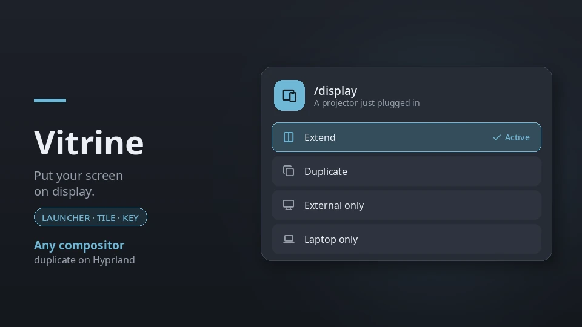

# Vitrine — a Win+P display switcher for Wayland



A *Vitrine* is the glass case in a Viennese café where the cakes are put on
display. This one puts your screen on display: plug in a projector, pick a
layout, done.

Wayland compositors have no "Win+P" menu. Switching a projector on means
editing monitor rules, `wlr-randr` incantations, or a kanshi profile — not what
you want thirty seconds before a talk. Vitrine puts the four layouts you
actually reach for in the launcher, on a control-center tile, and behind one
IPC call you can bind to your laptop's display key.

| Layout | What it does |
| --- | --- |
| Extend | External screen gets its own workspaces |
| Duplicate | External screen shows a copy of the built-in one (Hyprland) |
| External only | Built-in screen off |
| Laptop only | External screen off |

## Plugin

| Field | Value |
| --- | --- |
| ID | `137-trimethylxanthin/vitrine` |
| Entries | Launcher provider: `provider`; service: `control`; shortcut: `cycle` |
| Launcher Prefix | `/display` |

## Requirements

One of these, detected at startup:

| Compositor | How | Status |
| --- | --- | --- |
| **Hyprland** | `hyprctl`, both config parsers | Extend, external only and laptop only in daily use on the Lua parser; the hyprlang path and the new two-step switching are untested |
| **Sway, Scroll, niri, MangoWC, Labwc, dwl, River/Triad, Umbriel** | The standard `wlr-output-management` protocol, through [`uv`](https://docs.astral.sh/uv/) and a small Python helper (`lib/outputs.py`) | Written against the protocol; not tested on these compositors yet |

**Duplicate is Hyprland only.** It is the one compositor with real mirroring.
Everywhere else two screens at the same position still show their own
workspaces, piled on top of each other, so Vitrine does not offer it there and
says why.

On the protocol path, uv fetches the helper's one dependency,
[pywayland](https://pypi.org/project/pywayland/), the first time; that start
needs a network connection. Vitrine needs Noctalia's plugin API 24.

**Coming from Beamer?** Vitrine is Beamer, renamed and rebuilt to work beyond
Hyprland; Beamer is gone from this source. Disable
`137-trimethylxanthin/beamer`, enable `137-trimethylxanthin/vitrine`, and point
your display-key bind at `vitrine:control`. The launcher prefix is now
`/display`.

## Usage

Open the launcher and type `/display`. Four rows appear; the one you are on is
marked **Active**, and picking another switches to it straight away. Typing
filters on the visible name and on the internal id, so both `duplicate` and
`mirror` land on the same row.

Plug the external screen in first. With nothing attached, every layout except
**Laptop only** is a no-op, and the rows say so instead of failing quietly; a
row that is not possible right now (Duplicate off Hyprland, anything that
would light the built-in screen with the lid closed) says why.

The `cycle` shortcut is a control-center tile that steps to the next layout on
each click. Add it under **Settings → Control Center shortcuts**. The tile shows
the layout you are currently on.

To bind your laptop's display key, point it at the `control` service. In
`hyprland.conf`:

```
bind = , XF86Display, exec, noctalia msg plugin 137-trimethylxanthin/vitrine:control all cycle
```

In `hyprland.lua`:

```lua
hl.bind("XF86Display", hl.dsp.exec_cmd("noctalia msg plugin 137-trimethylxanthin/vitrine:control all cycle"))
```

In sway's (or Scroll's) config:

```
bindsym XF86Display exec noctalia msg plugin 137-trimethylxanthin/vitrine:control all cycle
```

In niri's `config.kdl`:

```kdl
binds {
    XF86Display { spawn "noctalia" "msg" "plugin" "137-trimethylxanthin/vitrine:control" "all" "cycle"; }
}
```

## IPC

The `control` service takes two events:

```sh
noctalia msg plugin 137-trimethylxanthin/vitrine:control all cycle
noctalia msg plugin 137-trimethylxanthin/vitrine:control all set mirror
```

`cycle` advances extend → duplicate → external only → laptop only → extend,
skipping the layouts that are not possible right now. `set` takes one of
`extend`, `mirror`, `external` or `internal`.

## Notes

**It will not black out your session.** A switch that turns a screen off comes
in two steps: first the screen that stays is switched on, then Vitrine reads the
monitors again, and only if it really came up is the other one switched off.
If the projector does not come on, the built-in screen stays on and Vitrine
says so. It gives a new screen up to three seconds to come up before it counts
as not there. With the laptop lid closed, **Laptop only**, **Duplicate** and
**Extend** are refused, since each would light the screen under the lid, and
the display key's cycle skips them. The lid is read from
`/proc/acpi/button/lid`, or from logind where a laptop has none.

**Extend brings back your layout.** Whenever Vitrine sees Extend on, it
remembers where every screen was, at which mode, scale and rotation, and
Extend puts exactly that back. If it has never seen one (you started in
External only), it places the external screens to the right of the built-in
one; on Hyprland it re-applies your config instead (`hyprctl reload`).

**Your panel comes back as it was.** Vitrine remembers the built-in screen's
mode, scale, rotation and position while it is on, in its data directory, so a
HiDPI or rotated panel does not come back at scale 1 or sideways, even after a
restart.

**Screens nobody can see are left out.** Headless outputs (for streaming or
screen sharing) and nested-session outputs are not counted as external
screens, so External only cannot switch you onto one.

**Aspect ratios.** Duplicate copies one framebuffer to both outputs. A 16:10
laptop panel on a 16:9 projector will letterbox. **External only** avoids it.

**The launcher and the tile stay current.** The control service reads the
monitors every few seconds and after every switch, and both show what it read,
so a layout changed from anywhere (a keybind, hotplug, the lid) shows up.

**Side effects.** Vitrine runs `hyprctl` on Hyprland and its own helper through
`uv` elsewhere, makes no network calls of its own, and writes one file: the
remembered layout, in its data directory.

**Tests.** `./tests/vitrine/run.sh` covers the decisions: which output is the
panel, which layout is on, the steps to another, the lid and headless rules,
and the Hyprland rules.
